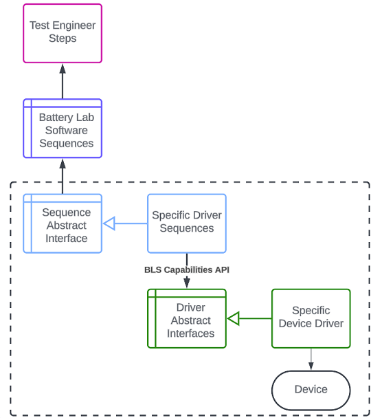

# bls-cycler-plugin-template
This repository contains a template for building a Battery Lab Software Plugin for a Cycler.

## Battery Lab Software Plugin Software Architecture

This repo implements the lower-2 layers (in green and blue). The "Device Specific" layer is written in LabVIEW which communicates to an specific device. This repo uses the [BLS Capabilities API](https://github.com/ni/bls-capabilities) as the "Device Abstract Interfaces". The Blue "Sequence Abstraction" layer is implemented in PAtools as a database export. Eventually we will add a VeriStand implementation for this "Sequence Abstraction" layer as well.

# Creating the LabVIEW Plugin

## Supported Versions

- PAtools 8.3+
- LinuxRT 23Q3+
- LabVIEW 2023Q3+
- BLS Capabilities API 0.5+
- ADAS Replay HIL Development Suite 24Q1

1. Install the ADAS Replay and HIL AD Development Suite for LabVIEW.
1. Install the [BLS Capabilities API](https://github.com/ni/bls-capabilities).
1. Refer to the [ADAS Plugin Development](https://github.com/ni/adas-replay-hil-internal/wiki/Node-Development) to create your basic plugin.
1. Refer to the BLS Capabilities API Readme for more information.

## LinuxRT IPKs for BLS Plugins

The test/ plugin contains an example for a package which will install the lvlibp to the RT target. Follow these simple steps to update your Plugin.

1. Open your Plugin LabVIEW Project.
1. Right-click Build Specifications.
1. Select Package.
1. Under Source Files, select the lvlibp.
1. Select the blue arrow to add the lvlibp to the destination.
  - :cactus: LabVIEW will compile the lvlibp and automatically configure the directory.
1. Select Package and configure all the fields for your device.
1. Select OK.

## Build

Build both build specifications and you will get a LinuxRT IPK file which should be provided as a release. Follow the paradigm in the /test folder and the releases of this repo for more guidance.

# Creating the PAtools Integration Layer

Refer to the [PAtools Integration Layer Readme](/src/patools-integration/README.md) for more information.

# Status Flags

:cactus: Update these flags to indicate what you have built-in so far.

- To indicate you've added support for these layers
  - Change the color at the end to Green
  - Change "Unsupported" to "Supported"

